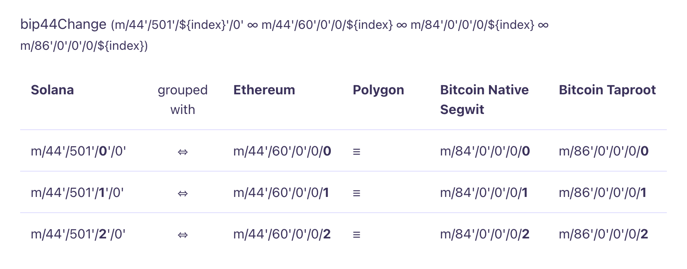

# Solana Wallet Generator

Author: [Abhijay Rajvansh](https://abhijayrajvansh.com)


This project is a tool for generating Hierarchical Deterministic (HD) wallets on the Solana blockchain. It uses BIP-32, BIP-39, and BIP-44 standards to create interoperable and deterministic wallets using mnemonic seed phrases.

## Features

- **Mnemonic Generation (BIP-39):** Create secure mnemonic phrases.
- **Seed Derivation (BIP-39):** Convert mnemonic phrases to seeds.
- **HD Wallet Generation (BIP-32 & BIP-44):** Generate Solana HD wallets using standard derivation paths.
- **Solana Wallet Integration:** Create and manage Solana wallets using generated keys.

## Solana Derivation Path



# Usage

### Generate a Mnemonic Phrase

Generate a 12-word mnemonic phrase, or you can use yours to import your wallet

```typescript
import bip39 from 'bip39';

const mnemonic = bip39.generateMnemonic();
console.log('Mnemonic:', mnemonic);
```

### Derive Seed from Mnemonic

Convert the mnemonic to a seed:

```typescript
const seed = bip39.mnemonicToSeedSync(mnemonic);
console.log('Seed:', seed.toString('hex'));
```

### Generate Solana HD Wallet

Derive the Solana wallet using the BIP-44 path:

```typescript
import { Keypair } from '@solana/web3.js';
import bs58 from 'bs58';

const solanaDerivationPath = `m/44'/501'/${i}'/0'`;
const derivedSeed = derivePath(solanaDerivationPath, seed.toString("hex")).key;

const privateKey = nacl.sign.keyPair.fromSeed(derivedSeed).secretKey;
const walletAddress = Keypair.fromSecretKey(privateKey).publicKey.toBase58();

console.log(`private key: ${bs58.encode(privateKey)}`);
console.log(`wallet address: ${walletAddress}`);

```

### Example Output

```bash
secret phrase: below lift romance poverty raise army black flag approve illness sort flip
warning: if you wish to use these generated solana wallets, make sure you backup/copy above secret phrase. ignore if done already.

master seed: 52ae3de24e074b7e6f1763d215f3a84f0361d2d1e27d250d4f61d5b8abfe9282344a458d21641fe6bceea483917c6592402b5273bed4d1e934163cfd4c702d1a

--- account: 1
relative seed: 3334644d0589cc7c27c628b77abd256a0a4608e62b6141fbeb083edd307a7449
private key: 22NswyrVTj8hERnxVJFDYJQbYQDBj4rAkmfoDrpaucY6mHCq9QRjiKAaVGysBWNKo3ukBGDwsK1fWTJZQoAGsVmk
wallet address: 3thi13Q7gs6NsJdNKCL323kXU9GKbeszrzgNtF2KKGN6
---

--- account: 2
relative seed: 1942143831ab3ae0008ed95b8cdebeba8883377642b764ad436ead465fdcfe48
private key: WHnkgxkUBvWBDtkVdhpMPdpveZki7LPk8aYCvN2cgm5hMRVNwHWDQFLqyRKYoARZZDTE6KLpco8WXDeBCNBpDhb
wallet address: 4yitQzVyERDoATYghVTESwZWsbFwdRq7iDATRnnEoR5K
---

--- account: 3
relative seed: d1560bbcba72898bf6176a67337d880344e6b454c9c878359a860dd15e23b768
private key: 5BkM9fDZwpJDpK9MqUvy5k3EcYZ8yib6sYaadBpKGZ5rVbZegh9R1AbngTTHN9Tn7nYpcZ1E9TJdHJJuv19d8F3H
wallet address: GRWVSxDL4rkP8QP4wDtAeXeSXq5QxPix7H43sCv7Vgn7
---
```

## Security

- **Keep your mnemonic phrase secure.** It can be used to generate all associated keys.
- **Never expose your private keys.** Handle them with care and avoid sharing them.

---